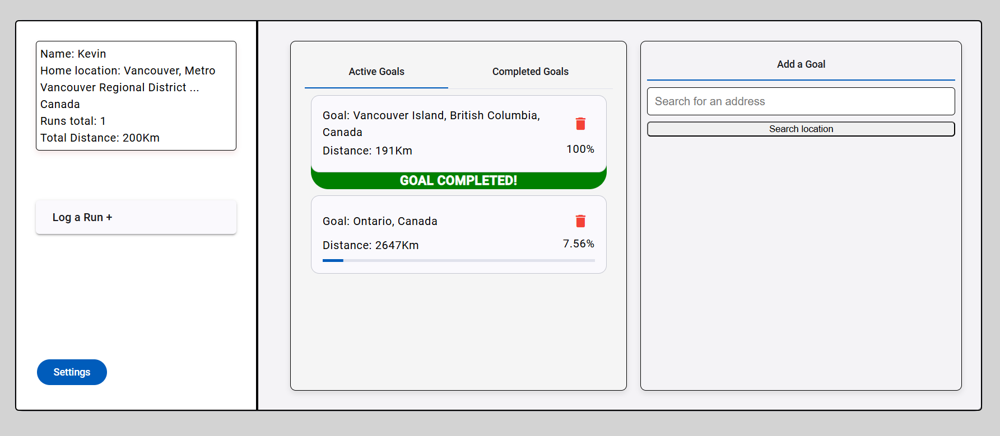
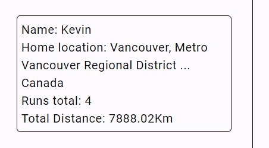
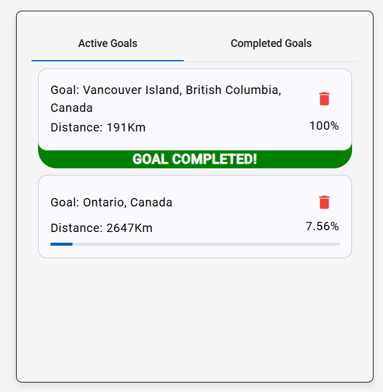
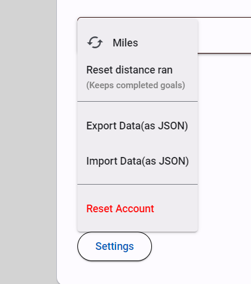
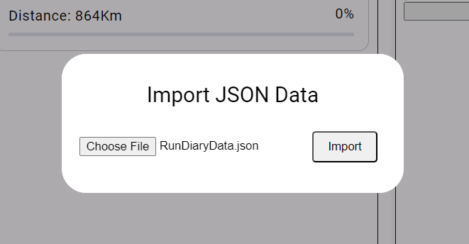

<!-- ## Development server

Run `ng serve` for a dev server. Navigate to `http://localhost:4200/`. The application will automatically reload if you change any of the source files. -->

# **_RunDiary_**

RunDiary is a web application where users can track their running progress towards a chosen destination from their home location. By logging runs, users can see the distance they've covered and how much further they need to go to reach their goal. It's a motivating way to visualize your running progress!

This project is my introduction to working with Angular and has been a collaborative effort with Luke, who had the initial idea and set up the foundation. From there, I took over, developing most of the app's logic and functionality.

This project is currently under development. The basic structure and design have been implemented, but additional styling and features are being actively worked on.

This project was generated with [Angular CLI](https://github.com/angular/angular-cli) version 18.1.3.

# Contents

- [**Technologies Used**](#technologies-used)
- [**Features**](#features)
  - [**Existing Features**](#existing-features)
    - [Initial Form Screen](#initial-form-screen)
    - [User Information](#user-information)
    - [Add Goal](#add-goal)
    - [Log Run](#log-run)
    - [Active Goals](#active-goal)
    - [Completed Goals](#compeleted-goal)
    - [Settings Button](#settings-button)
    - [Confirmation Modals](#confirmation-modals)

[Back to top](#contents)

# Technologies Used

- [HTML5](https://html.spec.whatwg.org/) - provides the content and structure for the website.
- [TypeScript](https://www.typescriptlang.org/) - used to write all the projects logic.
- [Angular](https://angular.dev/) - javascript framework, used for linking logic to html. The backbone of the website.
- [LESS](https://lesscss.org/) - CSS language extention - used for styling.
- [Material UI](https://mui.com/material-ui/) - used for component templates for faster and more cohesive design elements.
- [Local Storage](https://developer.mozilla.org/en-US/docs/Web/API/Window/localStorage) - all users information and running data is stored in local storage.
- [Git](https://git-scm.com/) - used for version control
- [Github](https://github.com/) - used to host and edit the website.
- [VSCode](https://code.visualstudio.com/) - Used for writing all the websites code.

[Back to top](#contents)

# Features

## Existing Features

- ### Initial Form Screen

  - If no data is detected in local storage, the user will be shown an inital form screen, where they are asked to enter a username, and choose their home location. The Submit form button will be inactive until the user has entered a username and chosen a starting location.

### User Information

- The users information is displayed at the top of the screen with their current running stats. The user is able to click on their username and change it at anytime.

### Add Goal

- Users can enter a location and choose from a list which they want to add as a goal. The users current total distance ran will then be used to calculate how much farther they have until they reach that goal.

### Log Run

- Here, users can log how far they have ran. This will automatically update their progress towards any active goals that they have.

>

### Active Goals

- A list is displayed with an active goals the user has added. The user can see the goal name, distance from their home location and a progress bar with how much percent they have so far.

- If the user has ran the total goal distance, then a clickable green section with 'GOAL COMPLETED' appears beneath the goal, that then moves it to the Completed Goals tab. Users have the option to delete a goal at any time.

### Completed Goals

- Similar to the Active goals section, the completed goals displays any goals the user has achieved, with the total distance that the user had ran. Any completed goals can also be deleted.

### Settings Button

- This dropdown menu has a number of features. Firstly, the user can change between Kilometers or Miles based on their preference. This dynamically updates all distances to a decimal place of 2.

- User can also set their running stats back to 0. This is useful if a user wants to start reset the distance they have ran so far, without deleting all the goals they have completed so far.

- Users can export their data as a JSON file incase they want to clear their local storage or open their progress on another browser.

- Users can upload a JSON file to resume their progress.

- A validation check will be done on this JSON file ot ensure that the expected JSON structure is met, and the user will be returned a success/failure message.

- Lastly users have the option to reset everything. This will wipe all the users information and reload the page to the initial form screen.

### Confirmation Modals

- There are two modals that pop up to confirm a users actions. One for confirming they want to delete a goal and another to confirm they want to reset their running stats/all of their information. This is to prevent any accidental deletions or data loss.

[Back to top](#contents)
